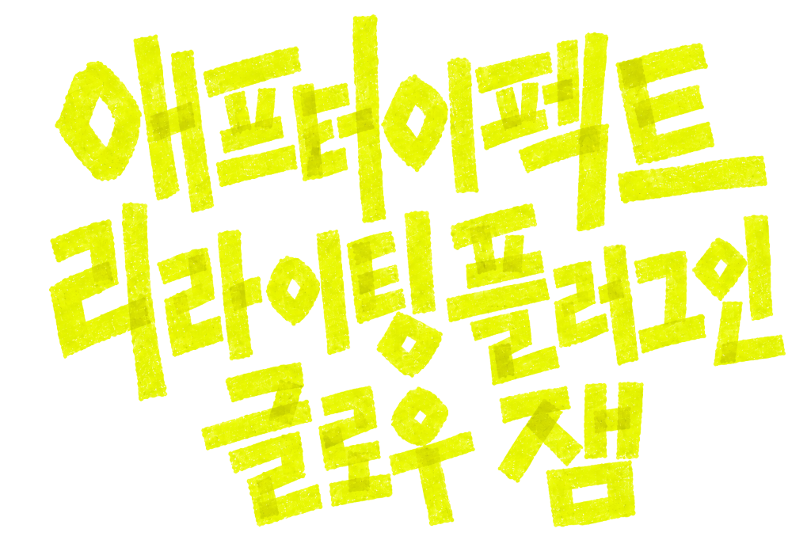

  

  
  
  
  
  
  
  

---

## 🌟 소개 (Introduction)

**Glow Jam**은 Adobe After Effects를 위한 **2.5D AI 공간 조명 리라이팅 및 실시간 깊이(Depth) 추론 플러그인**입니다.  
복잡한 3D 툴을 거치지 않고도, 2D 영상 푸티지나 일러스트레이션 위에서 AI가 직접 전후 공간을 인식하여 입체적인 조명과 그림자를 자유자재로 연출할 수 있습니다.

* **Glow Jam (2.5D Relighting):** 2D 평면 레이어 위에 Spread, Directional, Spot 조명을 배치하고 방향, 색상, 강도, 반경을 조절
* **Depth Jam (AI Depth Map):** Distill Any Depth Base 기반의 로컬 뎁스맵 추론과 256/512 px 품질 선택

---

## 📥 다운로드 (Download)

| 운영체제 | 다운로드 링크 | 비고 |
| :--- | :--- | :--- |
| **macOS** (Universal) | [**`Glow_Jam_macOS_0.12.0.dmg` 다운로드**](https://github.com/hyun2xyz/Glowjam/releases/download/v0.12.0/Glow_Jam_macOS_0.12.0.dmg) | Apple Silicon (M1~M4) & Intel Mac 지원, Apple 공증 완료 |
| **Windows** (64-bit) | [**`Glow_Jam_Windows_0.12.0.zip` (Releases)**](https://github.com/hyun2xyz/Glowjam/releases/latest) | Windows 10 / 11 지원, 원클릭 자동 설치 포함 |

---

## 🛠 설치 방법 (Installation)

> ⚠️ **설치 전 필수 확인:** 실행 중인 **Adobe After Effects를 완전히 종료**한 후 설치를 진행해 주세요.

### 🍎 macOS 설치 안내
1. 최신 [**`Glow_Jam_macOS_0.12.0.dmg`**](https://github.com/hyun2xyz/Glowjam/releases/download/v0.12.0/Glow_Jam_macOS_0.12.0.dmg) 파일을 다운로드하고 더블 클릭하여 엽니다.
2. 디스크 이미지 내의 **`Install Glow Jam.app`**을 실행합니다.
3. **[설치하기]**를 누르면 플러그인 2종과 AI 모델이 MediaCore 및 사용자 지원 경로에 자동 복사됩니다.
4. 완료 화면에서 **[닫기]**를 누른 뒤 After Effects를 실행합니다.
*(언제든 `Install Glow Jam.app`의 좌측 하단 **[제거...]** 버튼을 누르면 안전하게 원클릭 제거가 가능합니다)*

### 🪟 Windows 설치 안내
1. 최신 Windows 패키지 압축을 해제합니다.
2. **방법 A (원클릭 자동 설치 - 권장):**
   - `windows/원클릭_자동설치(우클릭후_관리자권한실행).bat` 파일을 마우스 우클릭 → **[관리자 권한으로 실행]**을 클릭합니다.
   - 자동으로 Adobe MediaCore 경로와 ProgramData를 감지하여 Glow Jam 플러그인과 로컬 런타임 파일을 설치합니다.
3. **방법 B (수동 복사 설치):**
   - 플러그인(`.aex`) 복사:  
     `C:\Program Files\Adobe\Common\Plug-ins\7.0\MediaCore\glow_jam\`
   - AI 가중치 모델(`model.onnx`) 복사:  
     `C:\ProgramData\glow_jam\models\runtime\distill-any-depth-base\model.onnx`

---

## 🎨 사용 방법 (How to Use)

After Effects를 실행한 뒤 효과를 적용할 레이어를 선택합니다:

1. 상단 메뉴 **`Effect` → `glow_jam`**으로 이동합니다.
   * **`Depth Jam`**: 영상에서 실시간으로 3D 뎁스맵을 계산합니다.
   * **`Glow Jam`**: `Surface Layer`에 뎁스맵 레이어를 연결하고, 화면 위의 조명 핸들과 Z 깊이를 조절하여 3D 빛을 연출합니다. `Light Mode`에서 Spread, Directional, Spot을 선택하고 Direction 가이드와 Spot Cone Angle을 조절할 수 있습니다.
2. 세부 조작법 및 단축키 안내는 [**상세 사용자 가이드 (USER_GUIDE.ko.md)**](docs/USER_GUIDE.ko.md)를 참고해 주세요.

---

## 📜 라이선스 및 제3자 고지 (License & Notices)

* **Glow Jam 플러그인:** [MIT License](LICENSE) (Copyright © 2026 Hyun Kim)
* **ONNX Runtime:** MIT License (Copyright © Microsoft Corporation)
* **AI 가중치 모델 (Distill Any Depth Base):**
  - 모델과 ONNX Runtime의 정확한 버전, 해시, 재배포 조건은 [**제3자 고지문 (THIRD_PARTY_NOTICES.md)**](docs/THIRD_PARTY_NOTICES.md)을 확인해 주세요.
  - 상업적 판매본에는 모델의 상업적 사용 및 가중치 재배포 권리를 확인한 경우에만 포함해야 합니다.

---

## 💬 문의 및 지원 (Support & Feedback)

플러그인 사용 중 발생하는 **버그, 호환성 문제, 개선 제안, 협업 문의**가 있으시다면 언제든지 편하게 연락해 주세요!

* 🌐 **공식 웹사이트:** [**hyun2.cloud**](https://hyun2.cloud)
* 📸 **인스타그램:** [**@hyun2xyz**](https://www.instagram.com/hyun2xyz/)
* 🐞 **버그 리포트:** [GitHub Issues](https://github.com/hyun2xyz/Glowjam/issues)
